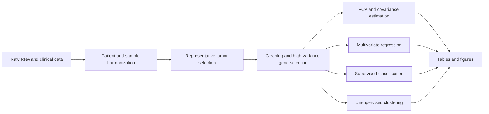

# Integrated Multivariate Analysis of TCGA PanCanAtlas Transcriptomic Data

An end-to-end multivariate analysis of TCGA PanCanAtlas RNA-seq expression and clinical data. The project builds a harmonized patient-level tumor cohort and applies dimensionality reduction, covariance regularization, multivariate regression, supervised classification, and unsupervised clustering to a shared transcriptomic feature space.

## Highlights

| Result | Value |
|---|---:|
| Final cohort | 10,055 patients |
| Cancer types | 32 |
| Original expression features | 20,531 genes |
| Training/test split | 8,044 / 2,011 |
| Variance explained by first 50 PCs | 57.94% |
| Regression cross-validated weighted R² | 0.6944 |
| Best held-out macro-F1 | 0.8928 |
| Highest held-out accuracy | 0.9135 |
| Best clustering ARI | 0.5406 |

Logistic regression produced the best balanced classification performance with a held-out macro-F1 of 0.8928. A multilayer perceptron achieved the highest raw accuracy, while K-means gave the strongest overall clustering agreement and stability.

## Analysis workflow



The pipeline performs the following analyses:

- Selects one representative tumor-derived profile per patient, prioritizing primary solid tumors.
- Removes empty features, imputes remaining gene-wise missing values, and creates shared top-2,000 and top-500 high-variance gene spaces.
- Fits PCA and evaluates component stability over repeated 80% subsamples.
- Compares empirical, Ledoit-Wolf, OAS, and graphical-lasso covariance estimates.
- Relates the first 10 expression PCs to clinical variables using ridge-based multivariate regression.
- Benchmarks logistic regression, linear and RBF SVMs, multilayer perceptrons, random forests, and histogram gradient boosting.
- Compares K-means, agglomerative clustering, and Gaussian mixtures using silhouette score, ARI, NMI, and subsample stability.

## Data

The project uses official open-access files from the [NCI Genomic Data Commons TCGA PanCanAtlas collection](https://gdc.cancer.gov/about-data/publications/pancanatlas).

| File | Purpose | Approximate size |
|---|---|---:|
| `EBPlusPlusAdjustPANCAN_IlluminaHiSeq_RNASeqV2.geneExp.tsv` | RNA-seq gene-expression matrix | 1.88 GB |
| `clinical_PANCAN_patient_with_followup.tsv` | Patient clinical and follow-up variables | 19 MB |
| `TCGA-CDR-SupplementalTableS1.xlsx` | Curated survival outcomes | 3 MB |
| `PanCan-General_Open_GDC-Manifest_2.txt` | GDC identifiers and checksums | 2 KB |

The expression matrix is tracked with [Git Large File Storage](https://git-lfs.com/). The committed data files were verified against the MD5 checksums in the GDC manifest.

### Retrieve the committed data

Install Git LFS before cloning the repository:

```bash
git lfs install
git clone https://github.com/amansd78/Integrated-Multivariate-Analysis-of-TCGA-PanCanAtlas-Transcriptomic-Data.git
cd Integrated-Multivariate-Analysis-of-TCGA-PanCanAtlas-Transcriptomic-Data
git lfs pull
```

### Download directly from the GDC

As an alternative to Git LFS, use the included downloader:

```bash
bash scripts/download_tcga_pancanatlas.sh
```

The files are written to `data/raw/tcga_pancanatlas/` by default. An alternative destination can be passed as the first argument.

## Installation

Requirements:

- Python 3.10 or newer
- Git LFS for the committed expression matrix
- Bash and `curl` when using the download script

Create an isolated environment and install the dependencies:

```bash
python -m venv .venv
```

On macOS or Linux:

```bash
source .venv/bin/activate
python -m pip install --upgrade pip
python -m pip install joblib matplotlib mizani numpy openpyxl pandas plotnine pyarrow scikit-learn scipy tqdm
```

On Windows PowerShell:

```powershell
.venv\Scripts\Activate.ps1
python -m pip install --upgrade pip
python -m pip install joblib matplotlib mizani numpy openpyxl pandas plotnine pyarrow scikit-learn scipy tqdm
```

> [!IMPORTANT]
> The current repository snapshot contains the command-line scripts but is missing the shared `src/stat662_tcga/` package they import. Restore that package before executing the analysis. Without it, the scripts raise `ModuleNotFoundError: No module named 'stat662_tcga'`.

## Running the pipeline

After restoring `src/stat662_tcga/`, run the complete workflow with:

```bash
python run_tcga_pipeline.py \
  --raw-dir data/raw/tcga_pancanatlas \
  --artifacts-root artifacts/tcga
```

The default configuration uses:

- 2,000 high-variance genes for PCA and predictive modeling
- 500 genes for covariance and graphical-model analysis
- a stratified 80/20 training/test split
- five-fold cross-validation for classification
- 50 principal components for classification
- 20 principal components for clustering
- random seed 42

To run only part of the workflow:

```bash
python run_tcga_pipeline.py \
  --raw-dir data/raw/tcga_pancanatlas \
  --start-at preprocess \
  --stop-after classification
```

Run `python run_tcga_pipeline.py --help` for all available options. Each stage can also be run independently with the input and output directories shown by that script's `--help` command.

## Project structure

```text
.
├── data/raw/tcga_pancanatlas/     # RNA expression and clinical inputs
├── scripts/
│   └── download_tcga_pancanatlas.sh
├── load_tcga.py                   # Build the harmonized sample manifest
├── preprocess.py                  # Clean data and create shared feature spaces
├── pca_covariance.py              # PCA, covariance, and graph stability
├── regression.py                  # Multivariate ridge regression
├── classification.py              # Supervised cancer-type benchmarks
├── clustering.py                  # Unsupervised method comparison
├── plots_tables.py                # Consolidated tables and figures
└── run_tcga_pipeline.py           # End-to-end pipeline runner
```

Generated analysis products are written under `artifacts/` and are intentionally excluded from version control.

## Main results

### Principal component analysis

- PC1 explains 6.61% of expression variance.
- The first 10 PCs explain 34.35%.
- The first 50 PCs explain 57.94%.
- Mean absolute loading correlations exceed 0.997 for PCs 1–5 across repeated subsamples.

### Multivariate regression

The ridge-based regression of the first 10 expression PCs on age, sex, pathologic stage, and cancer type achieved an in-sample weighted R² of 0.6982 and a five-fold cross-validated weighted R² of 0.6944 on 10,005 covariate-complete patients.

### Classification

| Model | Accuracy | Macro-F1 | Weighted F1 |
|---|---:|---:|---:|
| Logistic regression | 0.9115 | **0.8928** | 0.9141 |
| RBF SVM | 0.9055 | 0.8887 | 0.9084 |
| Linear SVM | 0.9020 | 0.8866 | 0.9040 |
| Multilayer perceptron | **0.9135** | 0.8809 | 0.9094 |
| Random forest | 0.9005 | 0.8615 | 0.8909 |
| Histogram gradient boosting | 0.8991 | 0.8613 | 0.8938 |

### Clustering

| Method | Silhouette | ARI | NMI | Subsample ARI |
|---|---:|---:|---:|---:|
| K-means | **0.2630** | **0.5406** | 0.6762 | **0.8020** |
| Agglomerative clustering | 0.2516 | 0.5335 | **0.7149** | 0.6522 |
| Gaussian mixture | 0.2356 | 0.5119 | 0.6757 | 0.6727 |

## Reproducibility notes

- The supervised benchmark uses a fixed stratified 80/20 split.
- Hyperparameters are selected using five-fold cross-validation on the training data only.
- PCA stability uses 10 repeated 80% subsamples.
- Clustering stability is measured using repeated-subsample adjusted Rand index.
- Randomized procedures use seed 42 by default.

## References

- The Cancer Genome Atlas Research Network. *The Cancer Genome Atlas Pan-Cancer analysis project.* Nature Genetics, 2013. [doi:10.1038/ng.2764](https://doi.org/10.1038/ng.2764)
- Liu et al. *An Integrated TCGA Pan-Cancer Clinical Data Resource to Drive High-Quality Survival Outcome Analytics.* Cell, 2018. [doi:10.1016/j.cell.2018.02.052](https://doi.org/10.1016/j.cell.2018.02.052)
- Hoadley et al. *Cell-of-Origin Patterns Dominate the Molecular Classification of 10,000 Tumors from 33 Types of Cancer.* Cell, 2018. [doi:10.1016/j.cell.2018.03.022](https://doi.org/10.1016/j.cell.2018.03.022)

## Author

Amandeep Singh
